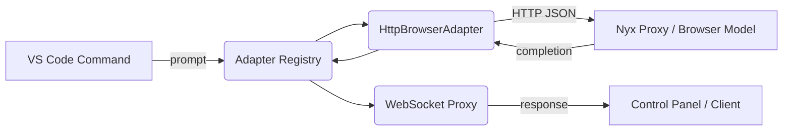

# DevConX Architecture Overview

DevConX is structured around three cooperating layers:

1. **Adapters** — Pure JavaScript modules that replicate Nyx browser model adapters using HTTP calls. Each adapter adheres to the shared interface documented in `src/core/types.js` and is instantiated through the `AdapterRegistry`.
2. **Proxy Server** — A WebSocket-based MCP proxy that accepts prompt dispatches, performs heartbeat broadcasts, and delegates requests to adapters. The proxy isolates VS Code processes from browser automation runtimes.
3. **Extension UX** — A VS Code extension entrypoint with a neon-themed control panel. The interface is implemented without React to comply with Alsania lightweight requirements.

## Data Flow



## MCP Proxy Contract

The proxy exposes a single WebSocket endpoint. Messages follow the structure:

- **Request**
  ```json
  {
    "adapterId": "nyx-firefox",
    "conversationId": "123",
    "prompt": "Hello world",
    "context": { "source": "control-panel" }
  }
  ```
- **Response**
  ```json
  {
    "type": "response",
    "data": {
      "adapterId": "nyx-firefox",
      "response": {
        "text": "Hi there",
        "latencyMs": 523,
        "usage": { "promptTokens": 12, "completionTokens": 24 }
      }
    }
  }
  ```

Heartbeats are emitted periodically to maintain liveness detection and list adapter capabilities for UI clients.

## Security Considerations

- Only localhost bindings are enabled by default. Expose the proxy externally intentionally and pair with TLS termination if required.
- Adapter headers support API key injection without hardcoding secrets in source control. Reference environment variables via Nyx proxy configuration.
- All configuration writes pass through Zod validation to prevent unvetted adapters from loading silently.

## Extensibility

- Add new adapters by extending `config/devconx.config.json`; no code changes required.
- Downstream tools can reuse `ProxyServer` and `AdapterRegistry` as standalone Node modules for headless deployments.
- Control panel assets reside in `src/frontend/control-panel` and can be themed or internationalised without touching business logic.

**Aligned with the Alsania AI Protocol v1.0.**
